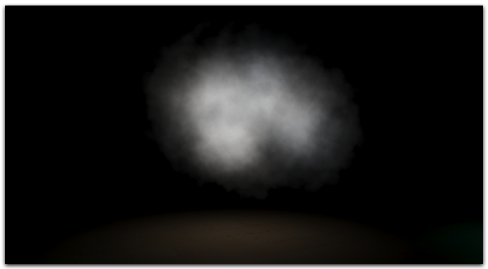
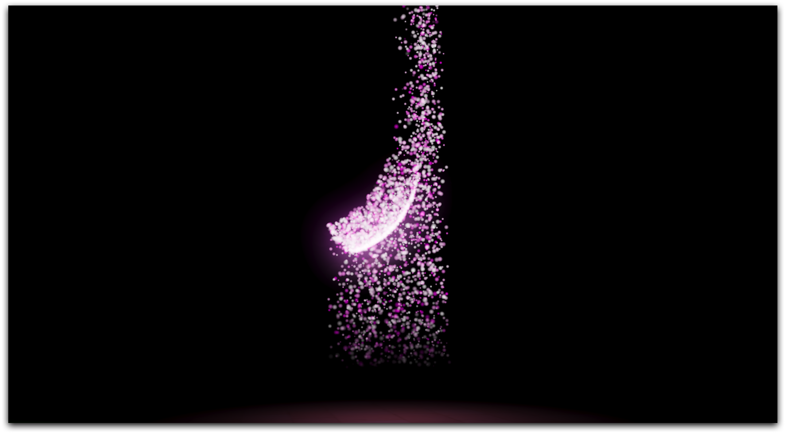

# Particles Demo

This demo uses the power of compute shaders to simulate differents particle system scenarios. 
The demo offers the next samples:

#### Gravity Forces

Gravity forces simulation:
* Every star has a **PointAttractorForce** component.
* Particle System with 1 million particles with noise enabled and forces enabled.

#### Emision from skinned meshes

This sample uses the **EntityShapeEmitter** for using the animated entity as a emitter.

#### Edge emission with flame simulation

This sample uses the **EdgeShapeEmitter** for emitting particles and the Noise function to simulate flames.

#### Cloud particles

Cloud simulation with particles:
* **SphereShapeEmitter** for emitting.
* **Initial angle** and **Angular velocity** randomized to create movement.

#### Wind Force

This sample uses the **WindForce** to disturb the particles movement.

#### Drag Force

This sample uses the **DragForce** to stop the particles movement.

----
Powered by **[Evergine](http://evergine.com)**

LET'S CONNECT!

- [Youtube](https://www.youtube.com/c/Evergine)
- [Twitter](https://x.com/EvergineTeam)
- [Blog](https://evergine.com/news/)
